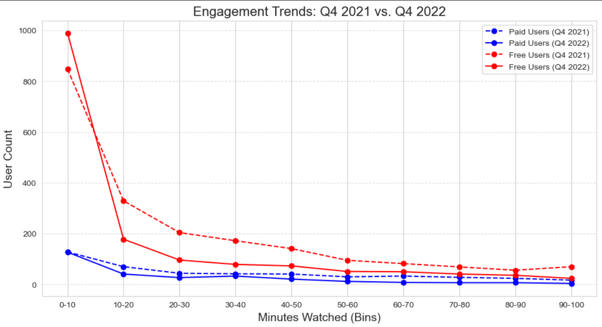
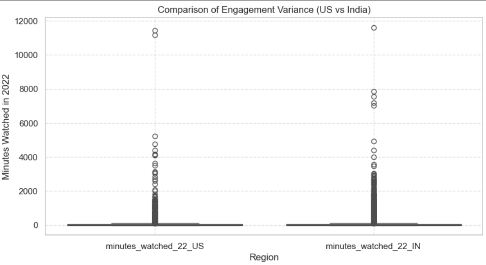

# Customer-Student Engagement Statistical Analysis Project

## Project Overview
In 2022, 365Data Science Company introduced several new features to boost student engagement, including:
- XP system for tracking progress
- In-app coins and special rewards
- Competitive leaderboards
- Streak-based motivation features
- Expanded course library

This project analyzes whether these changes led to increased engagement, using statistical analysis and data visualization.

## Business Understanding
### Problem Statement
In 2022, there were high expectations for the growth of the 365 company and increased student engagement due to the introduction of new platform features. These included an XP system that enabled students to track their progress, level up, and earn rewards by completing various learning objectives. The platform also introduced in-app coins for special awards, a leaderboard for competitive rankings and weekly rewards, and streaks to encourage consistent learning habits. Additionally, the company expanded its course library, covering a broader range of topics to enhance students' skills and attract a larger audience.

These enhancements were anticipated to positively impact the student experience, create an effective customer engagement strategy, and contribute to the company's success. This Customer Engagement Statistical Analysis in Python aims to assess whether the new platform features have led to increased student engagement.

## Project Objectives
This project analyzes customer engagement metrics for 365 Company to evaluate the impact of newly introduced platform features. The study focuses on understanding user behavior, comparing engagement trends, and deriving actionable insights to improve retention and growth strategies.

### Key Business Questions:
1. Did the new features (XP system, leaderboard, streaks) increase student engagement?
2. How did engagement levels in 2022 compare to 2021 across different regions?
3. Is there a significant difference in engagement between free and paid users?
4. Which regions showed the highest/lowest growth in engagement?
5. Do engagement patterns differ significantly across different learning topics?
6. What factors contributed to higher engagement, and how can they be optimized further?

## Data Understanding & Analysis
To evaluate customer engagement metrics, we analyzed a dataset containing anonymized user interactions from 365 Company. The dataset provides key insights into how students engaged with the platform before and after the introduction of new features in 2022.

## Data Sources & Description
The dataset used for this project comes from 365 Company and contains anonymized student engagement data from Q4 2021 and Q4 2022. It was structured to analyze the impact of new platform features introduced in 2022 on student activity.
- **Internal Learning Platform Logs** – Captured real-time student interactions with the platform.
- **User Engagement Metrics** – Tracked minutes watched, course completions, and retention rates.
- **Regional User Data** – Provided insights into geographic engagement trends.

## Visualizations:
1. Engagement Trends Over Time (2021 vs. 2022)
This line chart compares total minutes watched in Q4 2021 vs. Q4 2022, highlighting changes in engagement. The goal is to assess whether the new features contributed to increased student activity.

2. Regional Engagement Comparison: US vs. India
A boxplot comparing engagement levels between free-plan students in the United States and India in 2022.

3. Distribution of Minutes Watched (Q4 2022)
A histogram displaying the distribution of minutes watched by students in 2022.

These visualizations provide a clear picture of how student engagement evolved after the platform updates in 2022. The statistical tests and visual analysis confirm that regional differences exist, and some features may have been more effective in certain markets than others.

## Key Findings
- After conducting a detailed statistical and visual analysis of student engagement in 2022, we derived several critical insights:

1️⃣ **Engagement Increased Overall, but with Regional Variations**
- Total minutes watched in Q4 2022 increased compared to Q4 2021, suggesting that new platform features had a positive impact on student engagement. However, regional differences emerged—India showed significantly higher engagement compared to the US.

2️⃣ **Free-Plan vs. Paid Students: Impact on Engagement**
- Paid students watched more content on average than free-plan students.
- Engagement growth was higher among free-plan students, indicating that the new platform incentives (XP system, streaks, and rewards) were particularly effective for non-paying users.

3️⃣ **The US vs. India Engagement Comparison: Statistical Validation**
- Welch’s t-test confirmed that engagement in India was significantly higher than in the US (p-value < 0.0001).
- The distribution of minutes watched showed that the US had more low-engagement users, while India had a higher concentration of high-engagement students. This suggests potential cultural or structural differences in learning habits across regions.

4️⃣ **Feature Effectiveness/What Worked Best**
- The XP system, streak tracking, and leaderboard incentives played a key role in driving engagement, particularly for free users.
- The impact of in-app coins was less pronounced, indicating the need for further refinements.

 ## Recommendations
Based on our data-driven analysis of student engagement on the 365 platform, we propose the following key recommendations to further optimize engagement and retention:

1️⃣ **Increase Engagement in the US Market**
- Personalized Learning Reminders – Implement AI-driven engagement nudges based on individual learning patterns.
- Localized Incentives – Offer region-specific rewards and incentives that align with US learning habits.
- Community Features – Introduce study groups or peer challenges to encourage social learning, as seen in India.

2️⃣ **Optimize Free vs. Paid User Engagement**
- Enhance Premium Benefits – Increase exclusive content, early access, and higher XP multipliers for paid users.
- Time-Limited Premium Trials – Allow free users to experience premium features temporarily to boost conversions.
- Loyalty Programs – Reward long-term premium users with exclusive badges, discounts, or partner benefits.

3️⃣ **Improve Feature Effectiveness**
- Refine In-App Coin System – Align rewards with high-value engagement actions (e.g., completing complex topics).
- Gamification Expansion – Introduce challenges & competitions across global regions to drive retention.
- A/B Testing for Feature Optimization – Experiment with different XP structures, streak tracking incentives, and leaderboard mechanics to determine the most impactful elements.

4️⃣ **Regional Engagement Strategy**
- Localized Content & Learning Materials – Tailor course recommendations and notifications based on regional preferences.
- Optimize Mobile vs. Desktop Experience – Given higher mobile usage in India, enhance mobile-first features for engagement.
- Partnerships & Collaborations – Work with local influencers or institutions to boost community engagement.

5️⃣ **Data-Driven Decision Making for Future Growth**
- Continue Monitoring Engagement Trends – Regularly track minutes watched, retention rates, and feature adoption.
- Implement Predictive Analytics – Use machine learning to forecast churn risk and trigger retention interventions.
- User Feedback Loops – Gather direct student feedback on engagement features to iterate on the platform’s experience.

## Conclusion
The 365 Customer Engagement Analysis provided critical insights into student interaction with the platform in 2022, following the introduction of new features like XP tracking, in-app coins, leaderboards, and streaks. By leveraging statistical analysis and data visualization, we uncovered key trends, engagement disparities, and opportunities for improvement.

**Key Takeaways:**
- The new features significantly improved engagement in India but had a weaker impact in the US.
- Free-plan students showed varied engagement patterns, indicating the need for targeted engagement strategies.
- Paid users consistently exhibited higher engagement, confirming the value of premium features in retention.
- Statistical tests validated significant differences in engagement across regions, emphasizing localized optimization.

## Limitations 
While this analysis provided valuable insights into customer engagement on the 365 learning platform, several limitations were acknowledged:

1️⃣ **Data Availability & Completeness**
- Missing Data – A significant portion of engagement data (e.g. US minutes watched) had missing values, which required imputation. This may introduce slight bias in the results.
- Limited Time Scope – The dataset only covered Q4 2021 and Q4 2022, making it difficult to assess long-term trends or seasonal variations.

2️⃣ **Statistical & Analytical Constraints**
- Causality vs. Correlation – While the analysis identified engagement trends, it cannot definitively prove that new features caused the observed changes in student behavior.
- Assumptions in Hypothesis Testing – The statistical tests assumed normal distribution and independent samples, which may not fully reflect real-world engagement dynamics.

3️⃣ **Generalizability & External Factors**
- Regional Bias – The data primarily focused on US and India, which may not be representative of global engagement trends.
- Variables – External factors (e.g. marketing campaigns, pricing changes, global events) were not controlled for, potentially affecting engagement metrics.

**Future Work**
To further enhance the analysis and provide deeper insights into customer engagement on the 365 learning platform, the following areas can be explored in future studies:

1️⃣ **Expanding Data Coverage**
- Longitudinal Analysis: Extend the dataset beyond Q4 2021 & Q4 2022 to observe multi-year trends and seasonal variations.
- More Countries & User Segments: Include engagement data from more regions and different user groups (e.g. paid vs. free users, new vs. returning students).
- Additional Features: Collect more behavioral metrics such as course completion rates, quiz participation, and interaction frequency to better assess engagement.

2️⃣ **Advanced Analytical Techniques**
- A/B Testing: Implement controlled experiments to directly measure the impact of new features on engagement.
- Predictive Modeling: Use machine learning techniques to predict future engagement trends and identify at-risk users for proactive interventions.
- Sentiment Analysis: Analyze student feedback, reviews, and discussion forums to gain qualitative insights into user satisfaction.

3️⃣ **Business & Strategic Applications**
- Personalized Learning Paths: Leverage data-driven insights to create adaptive learning experiences tailored to individual students.
- Gamification Optimization: Refine gamification strategies (XP system, leaderboards, rewards) based on data-driven performance metrics.
- Marketing & Retention Strategies: Use engagement insights to improve user acquisition and retention through targeted marketing campaigns.

## 🙌 Acknowledgments
I extend my sincere appreciation to everyone who contributed to the successful completion of this project.

🎯 Special Thanks To:
- **365 Company** – For providing access to the dataset and allowing us to analyze customer engagement trends.
- **Data Science & Analytics Community** – For the wealth of knowledge and best practices that helped shape our methodology.
- **Open-Source Tools & Libraries** – Including Python, Pandas, NumPy, Matplotlib, Seaborn, and SciPy, which played a crucial role in data processing and statistical analysis.
- **Stakeholders & Mentors** – For their valuable feedback and guidance in refining our approach and ensuring impactful insights.

This project would not have been possible without the combined efforts of data professionals, educators, and learners who continue to push the boundaries of data-driven decision-making

Thank you!

### 📌 Let’s Connect!
- 🔗 LinkedIn: https://www.linkedin.com/in/allan-ofula-b2804911b/
- 🐙 GitHub: https://allan-ofula.github.io/, https://github.com/Allan-Ofula

